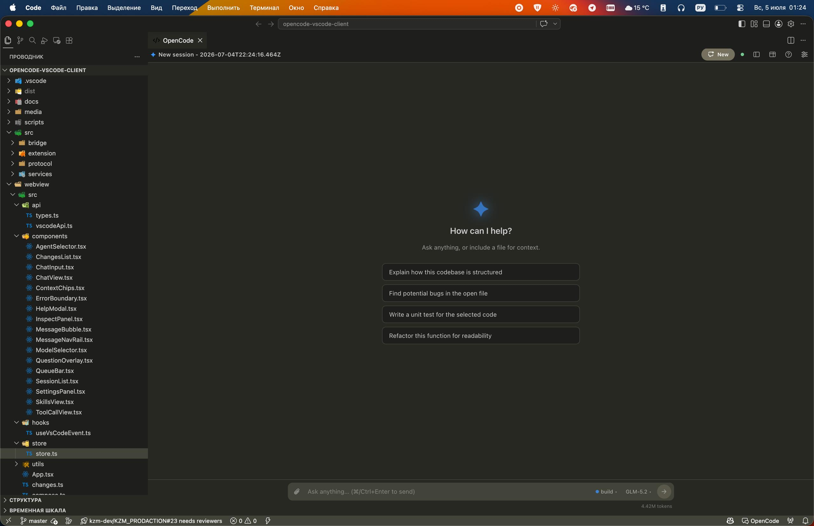
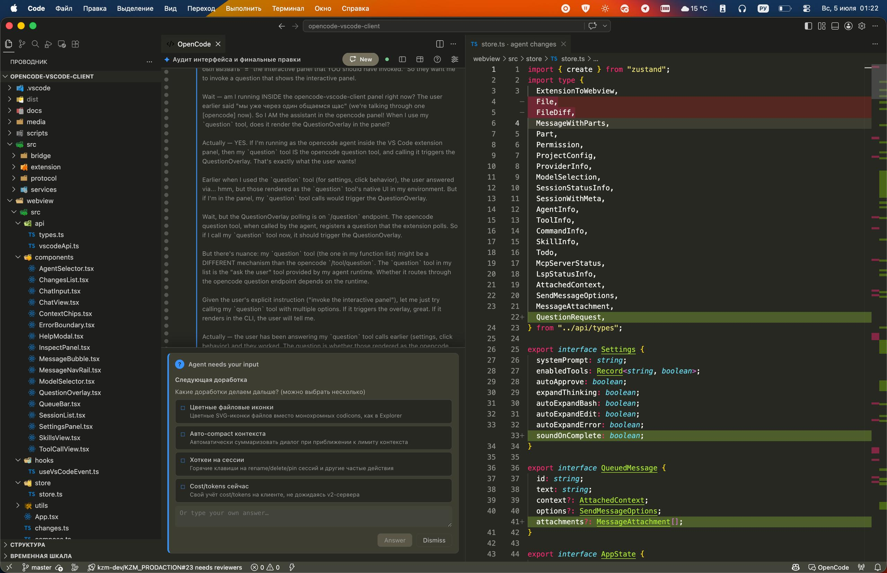
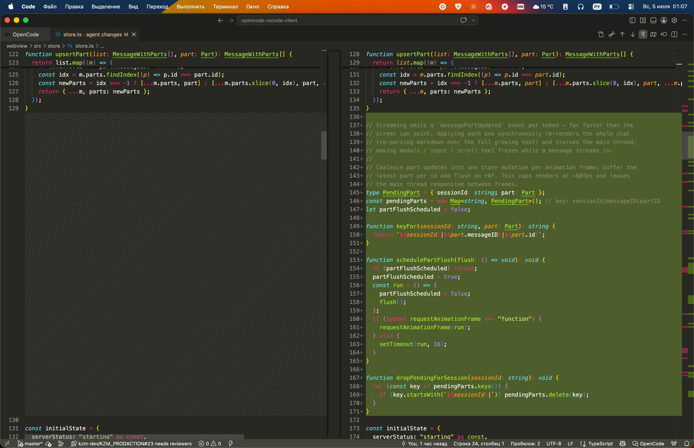
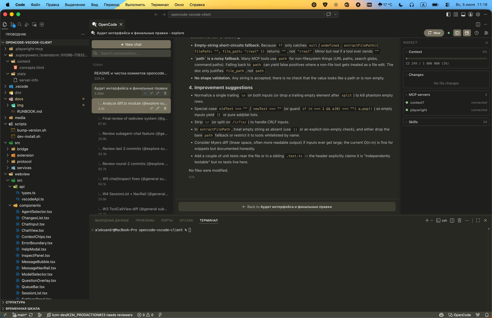
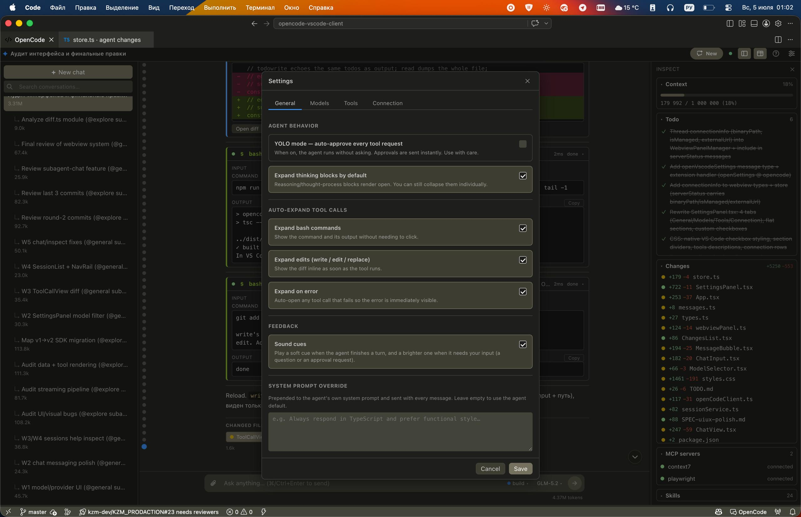

# OpenCode Client for VS Code

**English** | [Русский](README.ru.md)

---

A VS Code extension that uses a locally installed [OpenCode](https://opencode.ai) instance as the backend and ships its own native chat UI inside VS Code — lightweight frontend for the OpenCode backend, with first-class editor integration.



## Why

OpenCode is a powerful AI coding agent, but its own TUI is not a full editing environment: it can't match VS Code's file explorer, git workflow, multi-cursor editing, language servers, debugger, or the thousands of extensions you already rely on.

The existing ways to use OpenCode from VS Code all have tradeoffs:

- **Embed the OpenCode web UI in a panel.** That web UI was designed for the browser, not for an extension. It duplicates things VS Code already does (file tree, terminal), often spawns a *second* terminal, and is missing the integration hooks an extension needs.
- **Mirror the TUI console in a sidebar.** You get two views of the same thing and zero native integration — you're still driving a terminal inside an editor.

This extension takes a different approach: **a purpose-built frontend that talks to `opencode serve` over HTTP/SSE and stops there.** No duplicated file tree, no second terminal, no embedded TUI. Every feature is rendered as native VS Code UI — diffs open in the real diff editor, questions surface as overlays, settings live in the standard settings panel.

## Features

**Chat & sessions**
- Streaming responses over SSE, with markdown rendering (headings, lists, blockquotes, code blocks with language labels).
- Session list with search, pin, rename, delete, cost/token meta, grouped by day.
- Build / plan mode toggle, slash-commands, and skill shortcuts.
- Per-session drafts, retry, inline edit & resend, copy (with host-clipboard fallback — `navigator.clipboard` is unreliable in webviews).

**Approvals & questions**
- Inline tool-call approvals (allow once / always / deny).
- Client-side **YOLO mode** — auto-approve every tool call (`once` per request, no permanent server grants).
- Blocking-question overlay for agent prompts.



**Diffs & file changes**
- Pending-changes list with `+x/-y` line stats, status dots, native VS Code file icons.
- Click to open the real VS Code diff editor (not an in-panel approximation).
- Tool-call diffs (write/edit/str_replace) rendered inline with `+`/`-` lines.



**Models & agents**
- Searchable model picker grouped by provider, with badges for reasoning / tools / attachments and context-limit on hover.
- Hide whole providers or individual models; active provider always stays visible.
- Subagents view, agent switching, persisted selection.



**Context & inspect**
- Attach active file, text selection, diagnostics; `@mention` files via search.
- Inspect panel: context usage, todo checklist, file changes, MCP/LSP status, skills.

**Everything else**
- Keyboard shortcuts (`⌘/Ctrl+Enter` send, `⌘/Ctrl+L` focus input, `⌘/Ctrl+K` new session, `⌘/Ctrl+Shift+S` toggle sidebar, `?` help, `Esc` to interrupt a busy session).
- Optional attention sounds for blocking events and todo completion.
- Workspace-aware: auto-detects the current workspace, multi-root support.



## Requirements

- [OpenCode](https://opencode.ai) installed and on PATH (`which opencode`)
- VS Code 1.85+
- Node.js 18+ (for building from source)

## Getting started

### Install

**Option A — pre-built (recommended)**

Download the latest `.vsix` from [Releases](https://github.com/alexup71rus/opencode-for-vscode-light/releases), then:

```bash
code --install-extension opencode-vscode-client-<version>.vsix
```

**Option B — from source**

```bash
npm install
npm run compile
npm run dev:install      # compile → package → install into VS Code, then reload window
```

Or build a vsix to share:

```bash
npm run package:vsix     # produces opencode-vscode-client-<version>.vsix
```

### Use

1. Open a folder in VS Code.
2. Run **"OpenCode: Open Chat Panel"** from the Command Palette.
3. The extension spawns `opencode serve --port 0 --hostname 127.0.0.1` as a child process, auto-generates a random password, and connects.

## Configuration

| Setting | Default | Description |
|---|---|---|
| `opencode.binaryPath` | auto-detect | Path to the opencode binary. Leave empty to auto-detect via PATH. |
| `opencode.externalServerUrl` | (empty) | Connect to an external opencode server instead of spawning one. Example: `http://127.0.0.1:4096` |
| `opencode.serverPassword` | (empty) | Password for the external server. Spawned servers auto-generate one. |
| `opencode.defaultModel` | (empty) | Default model in `provider/model` format. Example: `anthropic/claude-sonnet-4-20250514` |
| `opencode.serverHostname` | `127.0.0.1` | Hostname for the spawned server. |

## Architecture

The extension host runs a `bridge → services → protocol` stack and talks to the webview over `postMessage`:

- **`src/extension/`** — VS Code integration: activation, commands, webview panel, context provider, diff provider.
- **`src/services/`** — framework-agnostic state (sessions, models, stats) on a small EventEmitter.
- **`src/bridge/`** — OpenCode connection: server lifecycle, SDK client wrapper, SSE event stream. Fully isolated — swappable (HTTP → WebSocket → ACP) without touching services or UI.
- **`src/protocol/`** — typed `postMessage` contract. Pure types, zero dependencies.
- **`webview/src/`** — React UI rendered inside VS Code.

The extension spawns `opencode serve`, parses the assigned port from stdout, authenticates with HTTP Basic via `OPENCODE_SERVER_PASSWORD`, and subscribes to the SSE event stream for real-time updates (message deltas, permissions, file changes). The child process is killed on deactivate.

## Development

Build, watch, package, and dev-loop instructions live in [`docs/RUNBOOK.md`](./docs/RUNBOOK.md). Short version:

```bash
npm run lint              # typecheck both projects (run before claiming done)
npm run compile           # one-shot build of extension + webview → dist/
npm run watch:extension   # esbuild watch (run alongside watch:webview)
npm run watch:webview     # vite build watch
```

For fast iteration, press **F5** to launch an Extension Development Host that loads the extension straight from `dist/` — no reinstall needed. See the RUNBOOK for the full two-loop workflow and gotchas.

## How it connects to OpenCode

1. Detects the `opencode` binary (config setting or `which opencode`).
2. Spawns `opencode serve --port 0 --hostname 127.0.0.1`.
3. Parses stdout for the assigned port.
4. Auth: random UUID password via `OPENCODE_SERVER_PASSWORD` env var, HTTP Basic auth.
5. Creates an `@opencode-ai/sdk` client pointed at the local server.
6. Subscribes to the SSE event stream.
7. Kills the child process on deactivate.

## License

Distributed under the [Apache License 2.0](./LICENSE).
